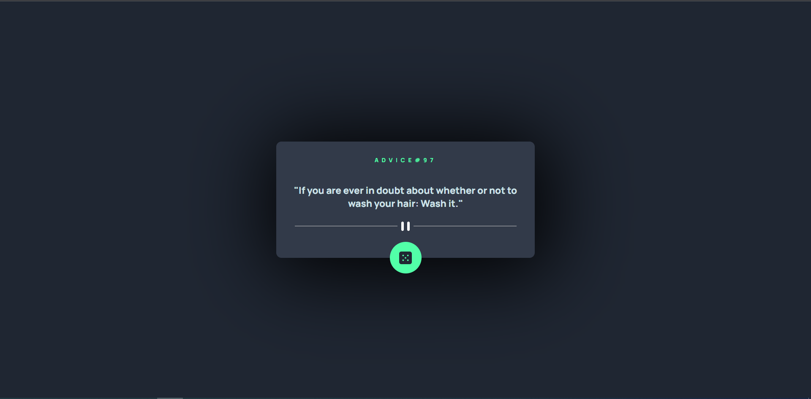

# Frontend Mentor - Advice generator app solution

This is a solution to the [Advice generator app challenge on Frontend Mentor](https://www.frontendmentor.io/challenges/advice-generator-app-QdUG-13db). Frontend Mentor challenges help you improve your coding skills by building realistic projects.

## Table of contents

- [Overview](#overview)
  - [The challenge](#the-challenge)
  - [Screenshot](#screenshot)
  - [Links](#links)
- [My process](#my-process)
  - [Built with](#built-with)
  - [What I learned](#what-i-learned)
- [Author](#author)
- [Acknowledgments](#acknowledgments)

**Note: Delete this note and update the table of contents based on what sections you keep.**

## Overview

### The challenge

Users should be able to see advice where they can change the content while clicking on dice which will come randomly.

### Screenshot

### Links

- Solution URL: [Click here](https://github.com/uttamsharma446/Advice-Generator)
- Live Site URL: [Click here](https://advice-generator-spyderr.netlify.app)

## My process

### Built with

- Flexbox
- [React](https://reactjs.org/) - JS library
- [Styled Components](https://styled-components.com/) - For styles

## Author

- Linkin - [Uttam Sharma](https://www.linkedin.com/in/uttamsharma446/)
- Frontend Mentor - [@uttamsharma446](https://www.frontendmentor.io/profile/uttamsharma446)
